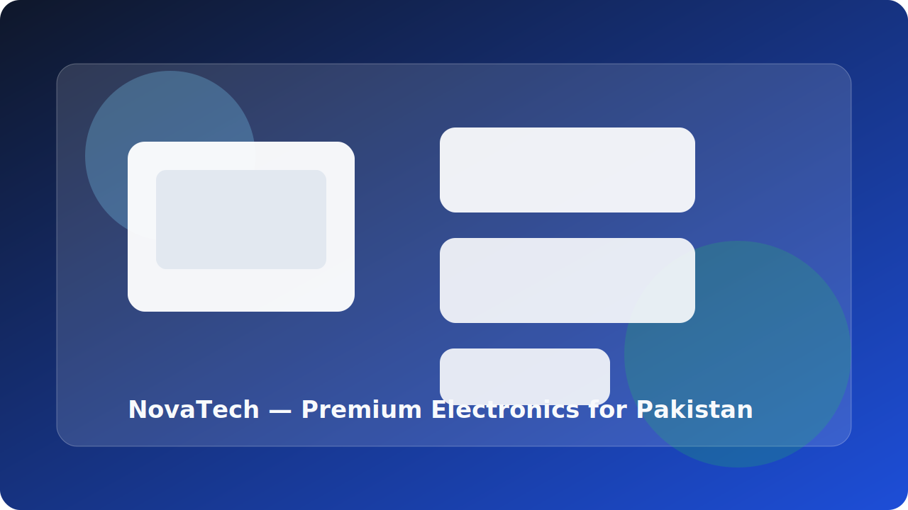

# NovaTech — Pakistan Electronics Store

A polished React + TypeScript + Vite storefront for the fictional Pakistani electronics brand NovaTech. The experience combines a premium product catalog, responsive shopping flows, local pricing in PKR, and a production-ready deployment setup.



## Live Demo

- Demo: https://novatech-ecommerce.netlify.app
- Repository: https://github.com/Farihakk67/NovaTech_Ecommerce_Website

## Overview

NovaTech is a complete eCommerce experience featuring a curated electronics catalog across laptops, smartphones, gaming gear, wearables, audio, cameras, and tablets. The site is designed to feel premium and modern while remaining fully responsive and accessible.

## Highlights

- Home, shop, product detail, about, and contact pages
- Responsive cart and wishlist flows
- Localized pricing and copy for Pakistan
- Live product search and filtering
- Dark mode, lazy-loaded imagery, and animated sections
- Docker-ready production build and CI workflow

## Tech Stack

- React 19
- TypeScript
- Vite 8
- Tailwind CSS 4
- React Router 7
- Framer Motion
- Vitest + React Testing Library
- ESLint + Prettier
- Docker + Nginx

## Project Structure

```text
src/
├── components/
│   ├── cart/
│   ├── common/
│   ├── home/
│   ├── layout/
│   ├── product/
│   └── ui/
├── context/
├── data/
├── hooks/
├── layouts/
├── pages/
├── services/
├── styles/
├── test/
├── types/
├── utils/
└── constants/
```

## Installation

```bash
git clone https://github.com/Farihakk67/NovaTech_Ecommerce_Website.git
cd NovaTech_Ecommerce_Website
npm install
```

## Scripts

```bash
npm run dev         # start local development server
npm run build       # type-check and create production build
npm run preview     # preview the production build locally
npm run lint        # run ESLint
npm run test:run    # run the test suite once
npm run test        # run tests in watch mode
```

## Docker

```bash
docker build -t novatech-store .
docker run -p 3000:80 novatech-store
```

Open http://localhost:3000 to view the app.

## Deployment

The project includes deployment-ready configuration for both Netlify and Vercel:

- Netlify: [netlify.toml](netlify.toml)
- Vercel: [vercel.json](vercel.json)

## Screenshots

| Page           | Preview                                                          |
| -------------- | ---------------------------------------------------------------- |
| Home           | [docs/screenshots/hero.svg](docs/screenshots/hero.svg)           |
| Shop           | [docs/screenshots/shop.svg](docs/screenshots/shop.svg)           |
| Product Detail | [docs/screenshots/product.svg](docs/screenshots/product.svg)     |
| Dark Mode      | [docs/screenshots/dark-mode.svg](docs/screenshots/dark-mode.svg) |
| Mobile         | [docs/screenshots/mobile.svg](docs/screenshots/mobile.svg)       |

## License

This project is intended for portfolio and educational use.
